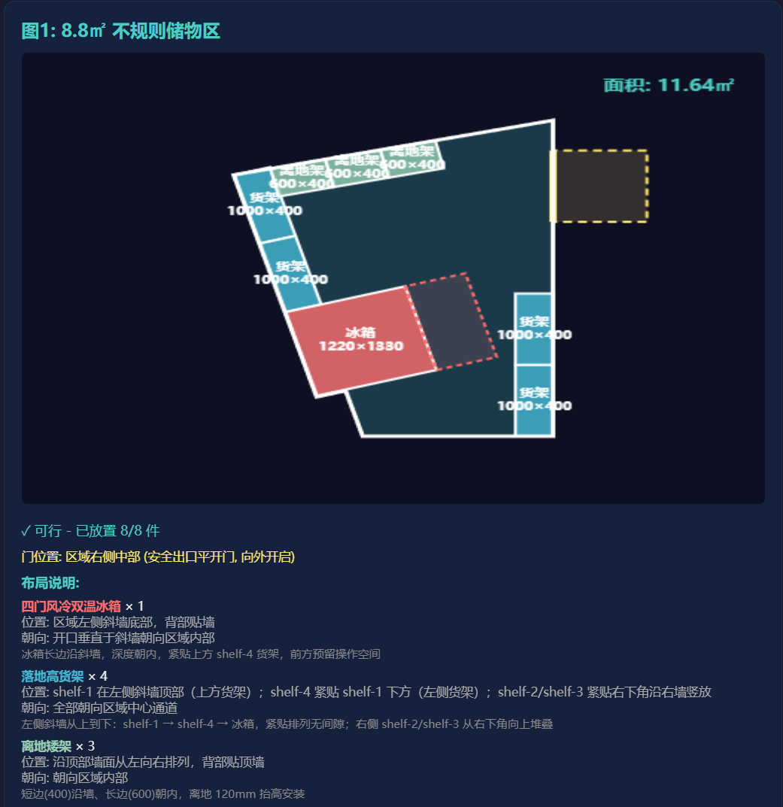
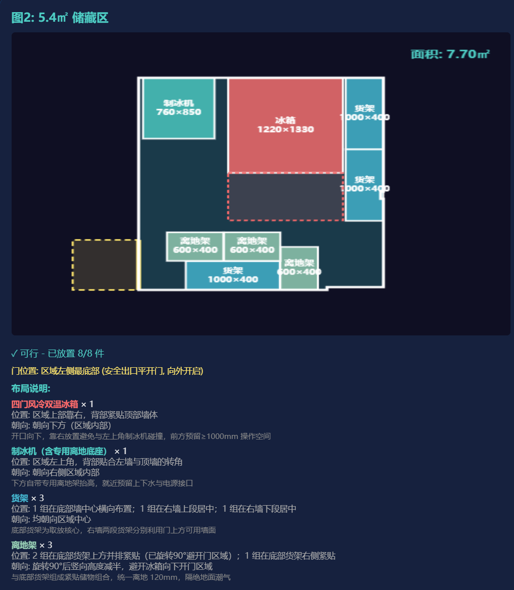
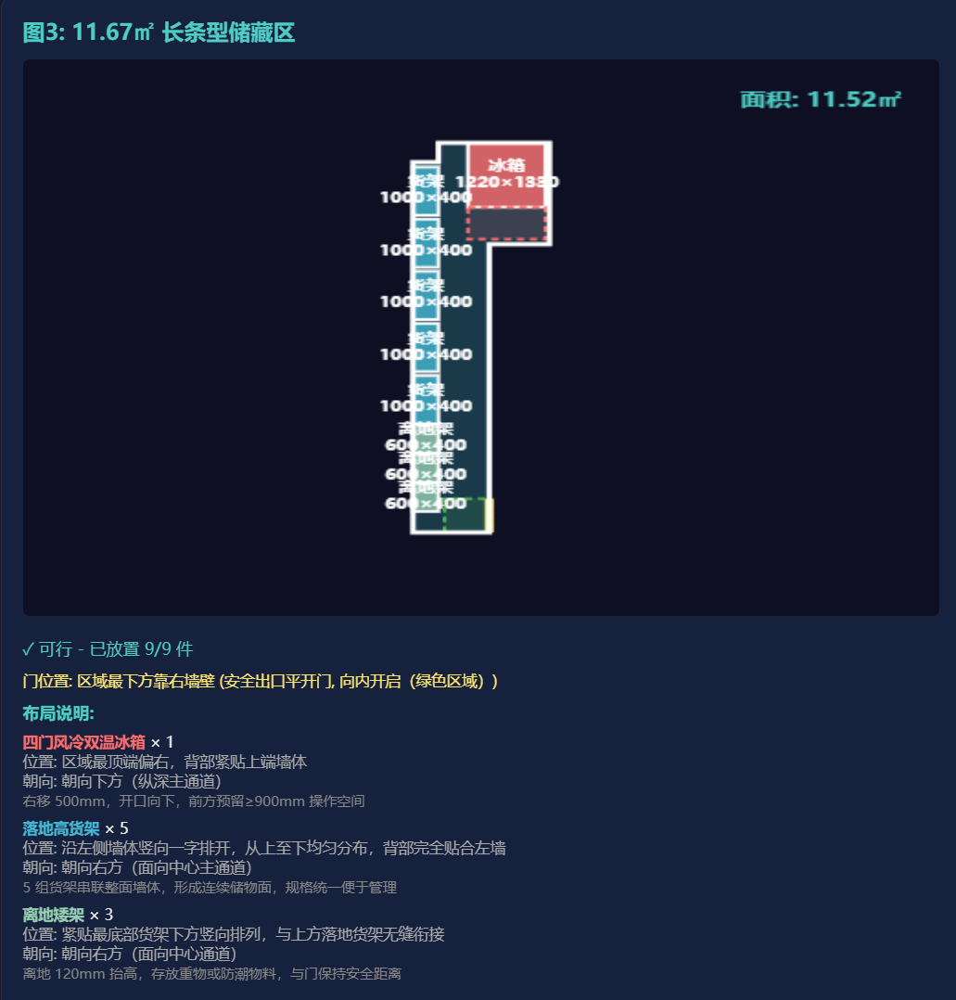
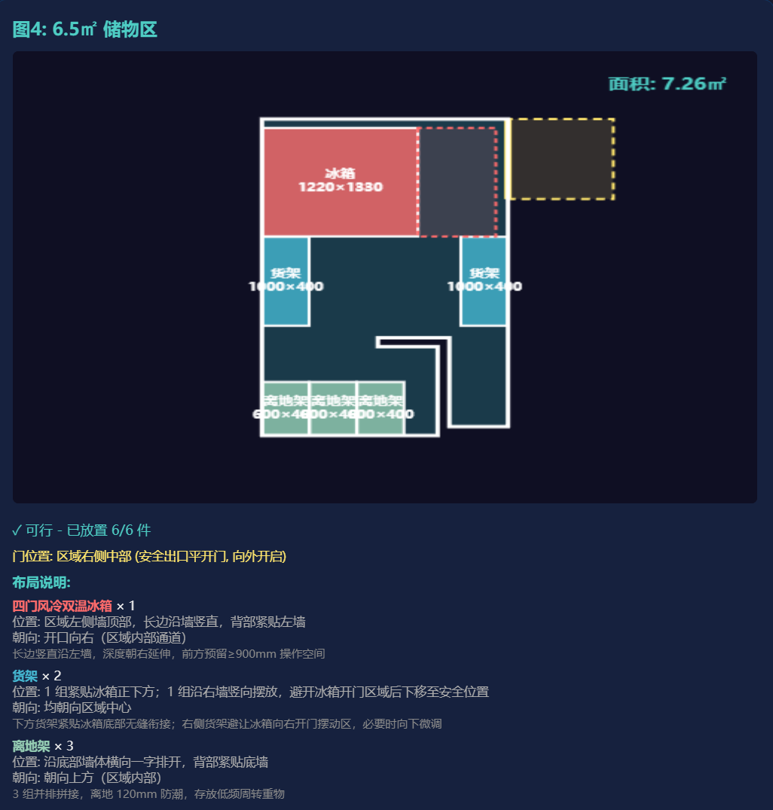

# 储物区设备摆放规划系统

## 1. 核心代码实现逻辑

### AI 工具使用说明

本项目使用以下 AI 工具辅助开发：

- **Trae IDE**：主力开发工具，用于代码生成、布局算法调优、碰撞检测修复
- **DeepSeek V4 Pro**：辅助思路拆解和方案验证
- **Doubao SeedCode**：辅助代码生成
- **Codex**：辅助 Debug 和代码优化

AI 主要帮助了**代码生成和 Debug** 环节，包括布局规划函数的编写、碰撞检测逻辑、渲染优化等。所有关键逻辑（物品紧贴墙壁的精确位置调整、门开口方向与开门区域的碰撞处理、四图各自的布局方案设计）均经过自己理解和反复调整。

### 整体架构

系统采用纯前端实现，单文件 `index.html` 包含 HTML/CSS/JS，无需任何依赖即可运行。

**核心流程：**

```
输入数据(边界轮廓+门+物品列表) → 识别墙壁边缘 → 按策略摆放物品 → 碰撞检测 → 渲染输出
```

### 关键模块

#### 1) 边界与边缘识别
- `identifyEdges()` 将轮廓点拆分为线段
- `findVerticalEdge()` / `findHorizontalEdge()` 识别水平/垂直墙壁
- `edgeNormal()` 计算墙壁法向量（始终指向区域内部）

#### 2) 物品摆放策略（4 个场景独立规划）

**图一（8.8㎡ 不规则储物区）：**
- 左斜墙从上到下：shelf-1 → shelf-4 → fridge，紧贴排列
- 右墙从底部向上：shelf-2、shelf-3 竖放
- 顶墙：3 个离地架旋转 90° 并排

**图二（5.4㎡ 储藏区）：**
- 制冰机固定左上角，冰箱靠顶墙右侧（与制冰机保持安全距离）
- shelf-1 底部居中，shelf-2/shelf-3 右墙顶部堆叠
- 3 个离地架在底部货架上方组合排列

**图三（11.67㎡ 长条型储藏区）：**
- 冰箱顶部平台居中偏右，开口向下
- 5 个货架沿左墙垂直排列
- 3 个离地架紧贴最底部货架下方
- 门为内开门（绿色摆动区域）

**图四（6.5㎡ 储物区）：**
- 冰箱长边沿左墙，开口向右
- shelf-1 紧贴冰箱下方
- shelf-2 右墙放置，自动避让冰箱开门区域
- 3 个离地架沿底墙并排

#### 3) 碰撞与边界检测
- `getFridgeSwingCorners()` 计算冰箱双开门摆动区域
- 门摆动区域可视化（外开门黄色虚线，内开门绿色虚线）
- 物品渲染后边界描边覆盖，消除白边缝隙

#### 4) 渲染
- Canvas 坐标系自适应缩放
- 各类型物品不同颜色区分
- 支持显示/隐藏标签、导出 JSON 结果

## 2. 运行环境及运行方式

### 环境要求
- 任意现代浏览器（Chrome / Edge / Firefox）
- **无需** Node.js、Python 等任何后端环境
- **无需** 安装任何依赖

### 运行方式

**方式一：直接打开**
```
双击 index.html 即可在浏览器中运行
```

**方式二：本地服务器（可选）**
```bash
# Python
python -m http.server 8080

# 或使用 VS Code Live Server 插件
```
然后访问 `http://localhost:8080`

### 操作说明
- 页面加载后自动运行全部规划
- 点击「运行全部规划」重新计算
- 点击「显示/隐藏标签」切换物品标注
- 点击「导出结果 JSON」下载规划数据

## 3. 既定输入的输出示例

### 输入数据格式

```json
{
  "boundary": [[x1,y1], [x2,y2], ...],  // 轮廓坐标
  "door": [[x1,y1], [x2,y2]],           // 门端点
  "isOpenInward": false,                 // 门类型
  "algoToPlace": {                       // 待摆放物品
    "fridge": [1220, 1330],
    "shelf-1": [1000, 400],
    ...
  }
}
```

### 输出结果

| 图号 | 面积 | 物品数 | 可行性 | 关键摆放 |
|------|------|--------|--------|----------|
| 图一 | 8.80㎡ | 8 | ✓ 可行 | 左斜墙紧贴 4 件 + 右墙 2 货架 + 顶墙 3 离地架 |
| 图二 | 5.40㎡ | 8 | ✓ 可行 | 冰箱+制冰机顶墙 + 底部货架组合 + 右墙货架 |
| 图三 | 11.67㎡ | 9 | ✓ 可行 | 冰箱顶部居中 + 左墙 5 货架 + 3 离地架（内开门） |
| 图四 | 6.50㎡ | 6 | ✓ 可行 | 冰箱左墙开口向右 + 底墙 3 离地架并排 |

### 运行界面截图

#### 图1：8.8㎡ 不规则储物区



#### 图2：5.4㎡ 储藏区



#### 图3：11.67㎡ 长条型储藏区



#### 图4：6.5㎡ 储物区



### 输出 JSON 示例（图一）

```json
{
  "example1": {
    "feasible": true,
    "items": [
      {"name": "shelf-1", "center": [5961.75, 28742.38], "rotation": 1.85},
      {"name": "shelf-4", "center": [5829.63, 29186.77], "rotation": 1.85},
      {"name": "fridge", "center": [5645.35, 29615.83], "rotation": 1.85},
      {"name": "shelf-2", "center": [7821.74, 32970.29], "rotation": 0},
      {"name": "shelf-3", "center": [7821.74, 31970.29], "rotation": 0},
      {"name": "overShelf-1", "center": [6195.85, 28542.38], "rotation": 0},
      {"name": "overShelf-2", "center": [6795.85, 28542.38], "rotation": 0},
      {"name": "overShelf-3", "center": [7395.85, 28542.38], "rotation": 0}
    ]
  }
}
```
